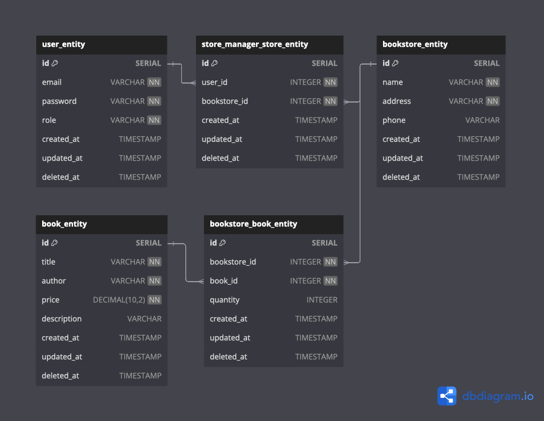

# Book Manager API

A comprehensive bookstore management system built with NestJS, featuring role-based authentication, store management, and book inventory tracking.

## Project Overview

This project is a RESTful API that manages bookstores, their inventory, and users. It provides a robust system for:
- Managing multiple bookstores
- Book inventory tracking
- User management with role-based access control
- Secure authentication system

## Database Structure

The system uses a relational database with the following main entities:



### Entity Descriptions:

- **user_entity**: 
  - Manages user accounts and authentication
  - Stores email, password, and role information
  - Roles can be admin, store_manager, or user. Permissions vary according to these roles.

- **bookstore_entity**: 
  - Stores bookstore information (name, address, phone)
  - Contains store management details

- **book_entity**: 
  - Contains book details (title, author, price, description)
  - Manages book metadata and pricing information

- **store_manager_store_entity**: 
  - Links store managers (users) to their assigned bookstores
  - Tracks which stores are managed by users with store manager permissions. A manager can manage multiple stores.
  - Manages the many-to-many relationship between users and stores

- **bookstore_book_entity**: 
  - Tracks book inventory for each bookstore
  - Manages quantity of books available in each store

## Authentication & Authorization

The system implements a role-based access control (RBAC) with the following roles:
- **Admin**: Full system access
- **Store Manager**: Can manage assigned bookstore inventory
- **Customer**: Can view books and make purchases

Authentication is handled via JWT tokens with secure password hashing. User roles and associated store information are cached in Redis.
This information is cached when the program starts. The cache is updated when user roles and store relationships change. The reason for not including
role and associated store information in the JWT is that if a user's role or associated store information is updated, the user would need to log in again,
which would negatively impact the user experience.

## Prerequisites

- Node.js (v16 or higher)
- Docker and Docker Compose
- PostgreSQL
- Redis
- Make (for Makefile usage)

## Quick Start

The project includes Docker configuration for easy deployment. 

1. Clone the repository:
```bash
git clone https://github.com/BarisKilicGsu/book_store_manager
cd book_store_manager
```

2. Create a .env file by copying the .env.template file.
```bash
cp .env.template .env
```

3. Setup the project and install dependencies:
```bash
make setup
```

4. Build and start all services:
```bash
make build
```

5. Show logs of all services in docker compose:
```bash
make logs
```

## Seed Data

The project includes seed data for testing. When the database is empty and the API is first launched, the database will be seeded. An admin user, regular users, and store information will be seeded. You can use the following admin credentials for testing:

- email: admin@bookmanager.com
- password: admin123

## Makefile Commands

The project includes various Makefile commands for convenience:

```bash
make test          # Run tests
make test-watch    # Run tests in watch mode
make test-coverage # Run tests with coverage
make clean         # Clean up the project
make setup         # Setup the project
make build         # Build and start all services
make rebuild       # Rebuild and start all services
make rebuild-api   # Rebuild and start only the api service
make logs          # Show logs
make logs-api      # Show api logs
make ps            # Show running containers
make stop          # Stop all services
make start         # Start all services
```

## API Documentation

The API documentation is available at `/api#/` when running the application. It provides detailed information about all available endpoints and their usage.

## Testing

```bash
# Unit tests
npm run test

# E2E tests
npm run test:e2e

# Test coverage
npm run test:cov
```

## Environment Variables

The project uses environment variables for configuration. A template file `.env.template` is provided in the root directory. Copy this file to `.env` and update the values according to your environment:


## Logging System

The application uses Winston logger for comprehensive logging with the following features:

### Log Types and Storage
- **Console Logs**: Real-time logs with colorized output for development
- **Error Logs**: Daily rotating files (`error-YYYY-MM-DD.log`) for error-level logs
- **Combined Logs**: Daily rotating files (`combined-YYYY-MM-DD.log`) for all log levels

### Log Configuration
- Logs are stored in the `logs` directory
- Files are automatically rotated daily
- Old log files are automatically compressed
- Configurable retention period and file size limits
- JSON format for file logs with timestamps

### Environment Variables for Logging
```bash
LOG_LEVEL=debug           # Global log level
LOG_CONSOLE_LEVEL=debug   # Console-specific log level
LOG_FILE_MAX_SIZE=20m     # Maximum size of each log file
LOG_MAX_FILES=14d         # How long to keep log files
LOG_DIRECTORY=logs        # Directory to store log files
```